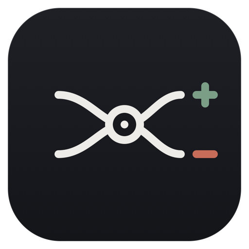
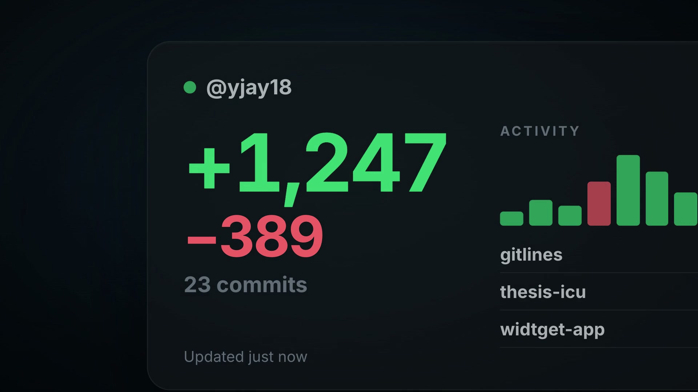

<p align="center">
  
</p>

<h1 align="center">Gitlines</h1>

<p align="center">
  Your real GitHub activity, on the macOS desktop.
</p>

<p align="center">
  <a href="https://github.com/yjay18/Gitlines/releases/download/v1.0/gitlines.dmg">Download 1.0</a> ·
  <a href="https://yjay18.github.io/Gitlines/">Website</a> ·
  <a href="#install">Install</a> ·
  <a href="#connect-github">Connect GitHub</a> ·
  <a href="#themes">Themes</a>
</p>

<p align="center">
  <a href="https://yjay18.github.io/Gitlines/#film"></a>
  <br><sub>21-second launch film. Click to watch.</sub>
</p>

---

Gitlines is a native macOS WidgetKit app. The widget shows exact commits, additions, deletions, net change, active intervals, peak activity and repository rankings for today, this week or this month, pulled across every branch. A small host app manages the GitHub connection, refreshes data, shows a snapshot dashboard and controls appearance.

> Every theme uses the same activity snapshot. Changing the look never changes the numbers.

## Features

- **Daily, weekly and monthly** periods, chosen per widget and cycled directly from the widget.
- **Calendar or rolling windows**: today, this week, this month, or the last 24 hours, 7 days, 30 days.
- **Real numbers**: commits, additions, deletions, net change, active intervals, peak activity, averages and repository rankings, from GitHub's per-commit statistics.
- **Every branch**: discovers recent work beyond the default branch and deduplicates commits that appear on more than one.
- **Personal and organization repositories**, each connected with its own fine-grained read-only token.
- **Four widget sizes** with purpose-built small, medium, large and extra-large layouts.
- **A theme per mood**, each rendering the identical snapshot. Changing the look never changes the numbers.
- **Snapshot dashboard** in the host app: activity pulse, change shape, rhythm, repository ledger and a plain-language review.
- **Resilient refreshes**: configurable timing, lightweight widget refreshes, cached results, stale-data indicators and retry states.
- **A commit snek** that grows one segment per commit. Its states are `smol snek`, `growing snek` and `snek happy`.

## Themes

| Theme | Look |
| --- | --- |
| **Default** | Restrained dark dashboard. Bright additions, coral deletions, compact charts, clear repository rows. |
| **Blockwork** | Modular studio. Drag panes into slots per widget size, hide panes, pick Workshop, Blueprint or Newsprint colourways and per-block colours. |
| **Glasshouse** | Dark translucent surfaces, hairline separators, mint additions, rose deletions, almost no chrome. |
| **Phosphor** | Terminal-inspired monospaced output, block-glyph charts, green activity, amber deletions, `git log`-style rows. |
| **Broadsheet** | Warm newsprint, serif type, press-red deletions, dotted day-book rows, engraved activity bars. |
| **Arcade** | Four-colour handheld palette built around the commit snek. Commits are the score, peak activity the high score. |

The Widget Studio in the host app previews every size live, sets a global theme with optional per-size overrides, and controls repository density, refresh timing and what the snek counts (commits, additions, deletions or net lines).

## Requirements

- macOS 14 or newer (native App Intent widget configuration and interactive retry).
- A GitHub account and a fine-grained personal access token with **Contents: read-only**.
- To build from source: Xcode 15.4 or newer.

## Install

Download [`gitlines.dmg`](https://github.com/yjay18/Gitlines/releases/download/v1.0/gitlines.dmg) from the [1.0 release](https://github.com/yjay18/Gitlines/releases/tag/v1.0), open it and drag Gitlines to Applications. Launch it once so macOS registers the widget, connect GitHub, then add Gitlines from the widget gallery.

macOS may warn that the app is from an unidentified developer. Right-click the app and choose Open to bypass that.

### Build from source

1. Open `widtget.xcodeproj` in Xcode.
2. Select the `widtget app` and `widtget` targets and assign the same development team under Signing & Capabilities.
3. Confirm the App Group `group.com.yjay18.widtget` is available to both targets.
4. Run the `widtget app` target once so macOS registers the embedded widget.
5. Connect GitHub in the host app (see below).
6. Add **Gitlines** from the macOS widget gallery. Edit a widget to pick Daily, Weekly or Monthly.

The product name is Gitlines. The `widtget` project, scheme, target, bundle and App Group identifiers are compatibility names and are not going to be renamed.

Releases are published at [yjay18/Gitlines/releases](https://github.com/yjay18/Gitlines/releases).

## Connect GitHub

1. In the host app, choose **Create a fine-grained token**. Pick your account as the resource owner, select the repositories to include, and keep the prefilled **Contents: read-only** permission.
2. Paste the token into the host app and choose **Connect GitHub**.
3. To include an organization's repositories, enter its GitHub name under **Add organization**. The generated link preselects that organization and the minimum read-only permission. Generate the token, paste it back and choose **Add organization**.
4. If the organization requires approval, an organization owner must approve the token first. A pending token cannot expose private repositories.

GitHub limits each fine-grained token to one resource owner, so every organization needs its own token. Gitlines checks that the organization is visible to the token and that all connected tokens authenticate the same GitHub user. Tokens are stored only in Keychain.

### How refresh works

- **Refresh** in the host app performs a full branch discovery and remembers branches with recent activity.
- Refreshing from the widget is lighter: it checks each active repository's default branch plus the remembered activity branches. Opening the app uses this lightweight refresh when the cache is older than 15 minutes.
- If a refresh fails, the widget keeps the last successful snapshot and marks it stale.
- **Fixed** windows use the current local calendar day, week or month. **Rolling** uses the last 24 hours, 7 days or 30 days. Both are cached on every refresh so switching is immediate.

## Architecture

- `GitHubActivityService` in `widtgetApp/GitHubActivityService.swift` is the only GitHub API client. It keeps tokens in the app-scoped Keychain, converts API responses into display-ready snapshots, and writes them atomically to the shared App Group container.
- `ActivityDataSource` in `widtget/Provider/ActivityProvider.swift` only reads that cache. The widget extension never receives tokens or makes authenticated requests.
- Deterministic snapshots exist only for Xcode previews (`WidtgetPreviews.swift`). A widget without cached data shows a setup prompt. Tapping a connected widget opens the authenticated user's GitHub profile.
- The `widtget app` target builds `gitlines.app` and embeds and signs the `widtget.appex` extension.

## Development

Unsigned compile check:

```sh
./script/build_and_run.sh build
```

Signed build with your Xcode team, widget registration and host-app launch:

```sh
./script/build_and_run.sh run
```

Build artifacts live under `.build/DerivedData` and are not committed. XcodeBuildMCP settings are in `.xcodebuildmcp/config.yaml`. Agent guidance is in `AGENTS.md`.

## Repository layout

| Path | Contents |
| --- | --- |
| `widtget/` | Widget extension: provider, views, themes, the snek. |
| `widtgetApp/` | Host app: GitHub service, connection manager, dashboard, Widget Studio. |
| `Shared/` | Preferences and models shared by both targets. |
| `docs/` | The GitHub Pages website and launch film. |
| `logo/` | Brand mark and app icon sources (SVG). |
| `brag-output/` | Launch film source composition and renders. |

## Website

The site in `docs/` is plain HTML with no build step, published from the `docs/` folder on `main`. Serve it locally with:

```sh
python3 -m http.server 8765 --directory docs
```

Gitlines is not an official GitHub product.
